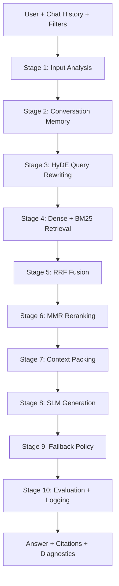
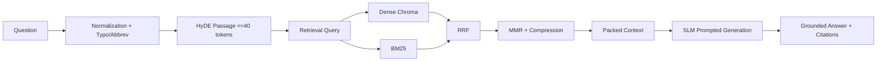
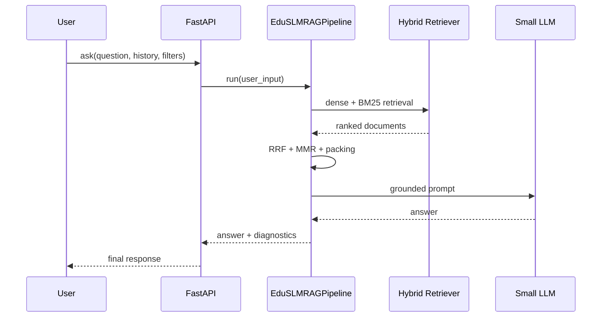

# EduSLM-RAG Thesis Documentation

## 1) Architecture Diagram

## 2) Data Flow Diagram

## 3) Sequence Diagram

## 4) Evaluation Methodology

- Retrieval: Precision@K, Recall@K, MRR, NDCG@K.
- Generation: BERTScore F1, RAGAS Faithfulness, Answer Relevancy, Context Precision, Context Recall.
- System: latency, token usage, peak memory.
- All runs export JSON and CSV and maintain experiment logs.

## 5) Experimental Setup

- Models: TinyLlama 1.1B, Llama 3.2 1B, Llama 3.2 3B.
- Embedding: BAAI/bge-small-en-v1.5 (optional MiniLM comparison).
- Retrieval: BM25 + Chroma dense search, weighted RRF.
- Context packing: model-aware token budgets.
- Ablation: 2x2x2 (HyDE x Retrieval x Packing).

## 6) Research Contributions

1. SLM-optimized 10-stage RAG stack with configurable fallback policy.
2. Hybrid dense+sparse retrieval with weighted RRF and diversity reranking.
3. Memory-aware conversational design with decay and summarization.
4. End-to-end automated evaluation and ablation framework.

## 7) Limitations

- RAGAS/BERTScore are optional dependencies and may be unavailable in constrained environments.
- Latency depends on local model serving and hardware.
- Heuristic ambiguity detection can underperform on complex discourse.

## 8) Future Work

- Learned reranker fine-tuned on educational QA.
- Adaptive fallback based on calibration models.
- Teacher rubric-aware answer scoring and pedagogy alignment.
- Distributed retrieval and caching for large-scale classrooms.
